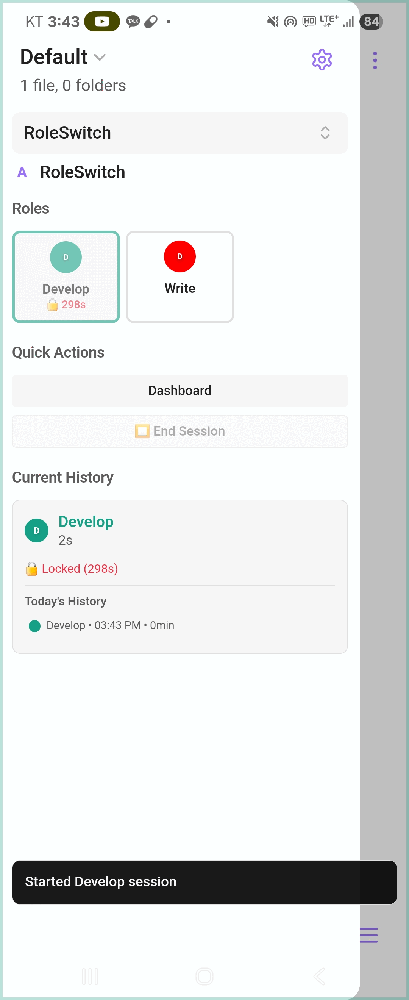

# RoleSwitch - Obsidian Plugin

An Obsidian plugin that helps you consciously switch between different work roles—like developer, writer, researcher, or QA—with intentional transitions and session tracking.

> **Why I built this**: I wear many hats throughout the day (developer, writer, researcher). This plugin helps me be intentional about which role I'm in and switch between them mindfully.

## Demo

### Mobile Demo

## Features

### Core Features
- **Custom Work Roles**: Define roles with unique colors and letter-based icons (A-Z)
- **Intentional Transitions**: Configurable transition delays with educational messages about context switching
- **Session Locks**: Minimum session duration prevents task-jumping and encourages deep focus
- **Role Awareness**: Visual cues (status bar, workspace borders, colored UI) remind you which role you're in
- **Session Tracking**: Track time spent in each role with real-time timers and historical data
- **Analytics Dashboard**: View daily, weekly, and monthly time statistics

### User Interface
- **Side Panel View**: Quick access to all roles with real-time session tracking
- **Role Dashboard**: Comprehensive analytics and session management
- **Smart Settings**: Preset buttons + direct input fields for easy configuration
- **Mobile Optimized**: Fully responsive design for mobile devices
- **Visual Feedback**: Click animations and color-coded role indicators

### Smart Features
- **Periodic Reminders**: Optional notifications to keep you aware of your current role
- **Real-time Updates**: Live countdown timers for session locks and durations
- **Data Preservation**: Historical data retained even when roles are deleted (appears as "Deleted Role")
- **Transition Messages**: Educational tips about context switching during role transitions
- **Auto-save**: Data saved periodically and when app is backgrounded (mobile-friendly)

## Use Cases & Examples

### Solo Developer Workflow
When you're wearing multiple hats on a project:

**🔧 Developer Role**: Writing code, implementing features
- Switch to Developer mode when coding
- Track time spent on implementation vs other activities
- Use role notes to capture technical decisions and code ideas

**🔍 QA Role**: Testing, bug hunting, quality assurance
- Switch to QA mode when testing your own code
- Approach your work with a different mindset - looking for issues rather than building
- Track testing time separately from development time
- Document bugs and edge cases in role-specific notes

**📋 Planning Role**: Architecture, project planning, requirements
- Switch to Planning mode for high-level thinking
- Step back from code details to see the bigger picture
- Track time spent on strategic thinking vs tactical work

### Content Creator Workflow
For writers, bloggers, and content creators:

**✍️ Writer Role**: Creating first drafts, brainstorming content
- Focus purely on getting ideas down without judgment
- Track productive writing time vs editing time
- Capture creative ideas in role-specific notes

**📝 Editor Role**: Reviewing, refining, and polishing content
- Switch mindset from creative to critical
- Approach your own work objectively for better editing
- Track revision time to understand your editing patterns

**📊 Reviewer Role**: Final review, fact-checking, publishing prep
- Final quality check with fresh perspective
- Ensure consistency and accuracy before publication
- Document review checklists and publishing notes

### Research & Analysis Work
For researchers, analysts, and knowledge workers:

**🔍 Researcher Role**: Gathering information, exploring topics
- Deep dive into sources and materials
- Track research time vs analysis time
- Collect and organize findings in role notes

**🧠 Analyst Role**: Processing information, drawing conclusions
- Switch from gathering to synthesizing mode
- Focus on patterns and insights rather than collection
- Document analytical frameworks and methodologies

**📊 Evaluator Role**: Reviewing findings, quality control
- Step back to assess research quality and completeness
- Challenge your own conclusions with fresh eyes
- Track validation and review activities separately

## Quick Start

1. **Install**: Enable "RoleSwitch" in **Settings → Community plugins**
2. **Setup**: Go to **Settings → RoleSwitch**
   - Create your work roles (e.g., "Developer", "Writer", "Researcher")
   - Choose letter icons (A-Z), colors, and descriptions
   - Configure transition duration and minimum session duration
3. **Access**: Open the RoleSwitch side panel from the left sidebar
4. **Start**: Click on any role to begin a session
5. **Switch**: When locked, wait for the minimum duration or use the transition modal
6. **Track**: View your analytics in the Dashboard button

## Settings Guide

### Session Settings
- **Transition duration**: Time to wait before switching roles (5-120 seconds)
  - Presets: 5s, 10s, 30s or enter custom value
- **Minimum session duration**: Minimum time before allowing role switches (5-60 minutes)
  - Presets: 5m, 15m, 30m or enter custom value

### Display Settings
- **Show status bar**: Display current role in Obsidian status bar
- **Show workspace border**: Visual border in role's color
- **Border opacity**: Adjust border visibility (0.1-1.0)
  - Presets: 0.3, 0.5, 0.8 or enter custom value
- **Show periodic reminder**: Enable role reminders
- **Reminder interval**: How often to show reminders (1-60 minutes)
  - Presets: 5m, 15m, 30m or enter custom value

## Documentation

- **[Features](docs/FEATURES.md)** - Detailed feature overview
- **[Installation](docs/INSTALLATION.md)** - Installation and setup guide
- **[Usage](docs/USAGE.md)** - Interface guide and usage patterns
- **[Troubleshooting](docs/TROUBLESHOOTING.md)** - Common issues and solutions
- **[Development](docs/DEVELOPMENT.md)** - Contributing and technical details

## Key UI Elements

### Side Panel
- **Header**: Shows plugin logo and title
- **Roles Grid**: Click any role to start/switch sessions
- **Current Session**: Real-time duration and lock status
- **Quick Actions**: Dashboard and End Session buttons

### Transition Modal
When switching roles, you'll see:
- Countdown timer
- Educational message about context switching
- Cancel button if needed

### Role Dashboard
- **Analytics**: Today, week, and month statistics
- **Current Session**: Live tracking with lock countdown
- **Averages**: Daily averages for week and month

## Version Information

- **Version**: 0.1.0
- **Minimum Obsidian**: 1.6.0
- **Platforms**: Windows, macOS, Linux, iOS, Android
- **License**: MIT

## Recent Updates

### UI/UX Improvements
- Letter-based icons (A-Z) for simpler role identification
- Click highlight effects for better visual feedback
- Improved icon selection with color toggle
- End Session button always visible (disabled when locked)
- Logo integration in side panel and dashboard

### Feature Enhancements
- Preset buttons + direct input for all settings
- Unit labels for better clarity (seconds, minutes, opacity)
- Transition messages with context switching education
- Periodic reminders with customizable intervals
- Real-time lock countdowns in multiple locations

### Data & Stability
- Auto-save on app backgrounding (mobile-friendly)
- Historical data preserved when roles deleted
- Error handling for save operations
- Fixed mobile data persistence issues

## Disabled Features

The following features are currently disabled in this version but remain in the codebase for future use:

- **API & Synchronization Settings**: Combined API server and device synchronization functionality (will be enabled in a future version)
- **Donation Section**: Support development section in settings (currently commented out)

These features can be re-enabled by uncommenting the relevant sections in `src/settings/Settings.ts`.

---

*Be intentional about your roles. Switch with purpose.*