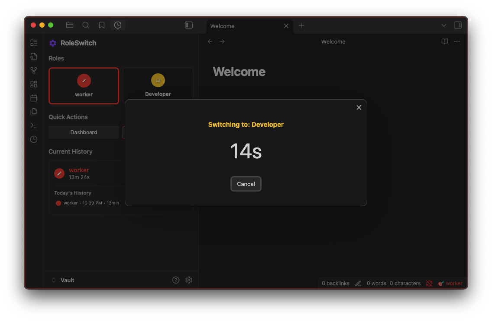
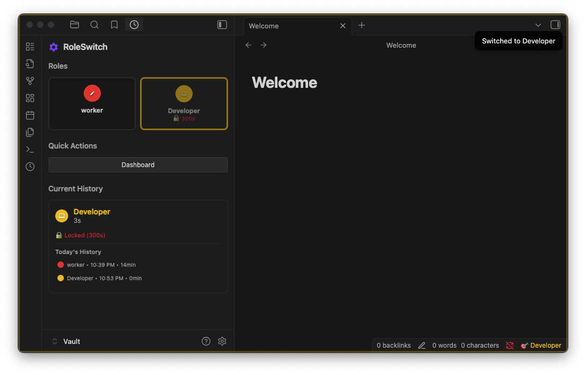

# RoleSwitch - Obsidian Plugin

An Obsidian plugin that helps you consciously switch between different work roles—like developer, writer, researcher, or QA—with intentional transitions and session tracking.

> **Why I built this**: I wear many hats throughout the day (developer, writer, researcher). This plugin helps me be intentional about which role I'm in and switch between them mindfully.

## Demo

### Switch

## Features

- **Custom Work Roles**: Define roles like Developer, Writer, Researcher, QA with unique colors and icons
- **Intentional Transitions**: Session locks encourage mindful role switching instead of random task-jumping
- **Role Awareness**: Visual cues (status bar, workspace borders) remind you which role you're in
- **Session Tracking**: Track time spent in each role with real-time timers
- **Role Notes**: Capture thoughts and context specific to each role session
- **Analytics Export**: Review your role patterns with CSV/JSON export

## Quick Start

1. **Install**: Enable "RoleSwitch" in **Settings → Community plugins**
2. **Setup**: Go to **Settings → RoleSwitch** and create your work roles (e.g., "Developer", "Writer", "Researcher")
3. **Use**: Click the clock icon in the ribbon to open the role panel
4. **Switch**: Click on any role to enter that mindset and start tracking time

## Documentation

- **[Features](docs/FEATURES.md)** - Detailed feature overview
- **[Installation](docs/INSTALLATION.md)** - Installation and setup guide
- **[Usage](docs/USAGE.md)** - Interface guide and usage patterns
- **[Troubleshooting](docs/TROUBLESHOOTING.md)** - Common issues and solutions
- **[Development](docs/DEVELOPMENT.md)** - Contributing and technical details

## Version Information

- **Version**: 0.1.0
- **Minimum Obsidian**: 1.6.0
- **Platforms**: Windows, macOS, Linux, iOS, Android
- **License**: MIT

---

*Be intentional about your roles. Switch with purpose.*